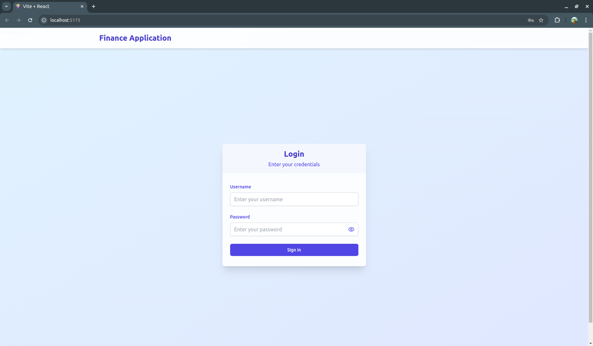
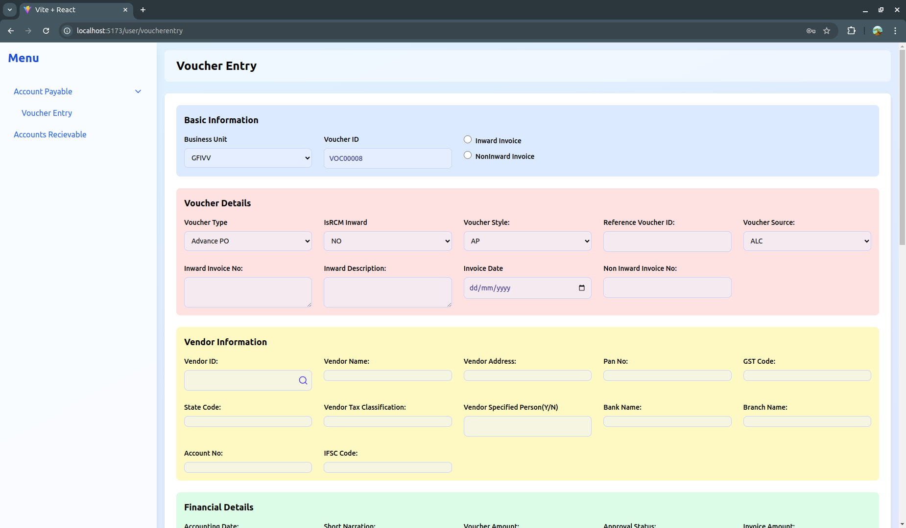
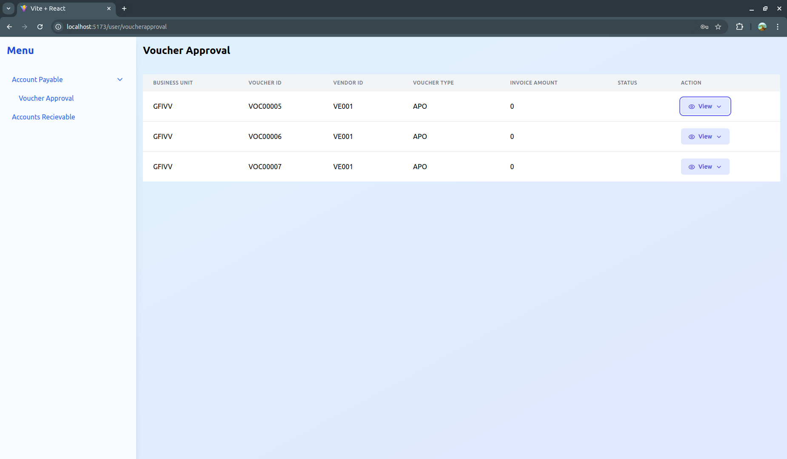

# Voucher Entry Application

## About the Application
The Voucher Entry and Approval Page is a core component of a finance application designed to streamline the voucher management process. It allows users to create, view, and approve vouchers with ease, ensuring accuracy and compliance with financial workflows.

## Application Preview
  



## Features
- **Voucher Entry:** Create new vouchers with unique IDs and add associated debit and credit entries.  
- **Approval Workflow:** View and approve vouchers with detailed information.  
- **User Role Management:** Role-based access to ensure secure and efficient approvals.  
- **Real-Time Updates:** Fetch and display updated data using seamless API integration.

## Installation
To run this application locally, follow these steps:

1. **Clone the repository:**
    ```bash
    git clone https://github.com/your-username/voucher-entry.git
    cd voucher-entry
    ```

2. **Install backend dependencies:**
    ```bash
    cd backend
    npm install
    ```
     - in the `.env` file change the `DATABASE_URL="your mysql url"` refer [prisma docs](https://www.prisma.io/docs/orm/overview/databases/sql-server)

3. **Install frontend dependencies:**
    ```bash
    cd ../frontend
    npm install
    ```

4. **Run the application:**
    - **Backend:**  
        ```bash
        cd backend
        npm run dev
        ```
    - **Frontend:**  
        ```bash
        cd frontend
        npm run dev
        ```

## How to Use
1. **Voucher Entry:**
   - Navigate to the "Voucher Entry" page.
   - Fill in the required fields and submit a new voucher.
   - Each voucher will be assigned a unique ID, e.g., `VOC00001`.

2. **Voucher Approval:**
   - Access the "Voucher Approval" page as an authorized user.
   - Review pending vouchers and approve or reject them.

## Development
This application is built using a modern stack:
- **Frontend:** React, Axios, and reusable UI components.
- **Backend:** Node.js, Express, and a relational database.
- **Deployment:** Vercel for both frontend and backend.

## Contributing
Contributions are welcome! Feel free to submit a pull request or open an issue to suggest enhancements or report bugs.

---


# Getting Started
Before running the project, make sure you have the following installed

 - Node.js (https://nodejs.org/en)
 - npm (node package manager, comes with Node.js)
 
 ## Installation
 ### Clone the repository (skip this step if you have code locally)

```
git clone https://github.com/your-username/your-project.git

cd frontend
npm install
cd backend
npm install
```

 - in the `.env` file change the `DATABASE_URL="your mysql url"` refer [prisma docs](https://www.prisma.io/docs/orm/overview/databases/sql-server)
 
 ### In the backend folder run
 `npm run dev`
 
 ### In the frontend folder run
 `npm run dev`


 


